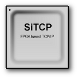
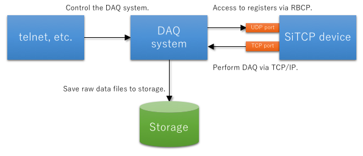

## SiTCP software development support library

Software development support library for SiTCP devices in Python.

* Programming language: Python 2.6, 2.7, 3.3+
* License: MIT License

Read this in other languages: [English](README.md), [日本語](README.ja.md)




### What is SiTCP

* Simple TCP/IP implemented on an FPGA (Field Programmable Gate Array) for the purpose of transferring large amounts of data in physics experiments.
* High speed and reliable data transfer can be performed in TCP session.
* Supports register access with RBCP(UDP), you can configure the system simply by omitting troublesome parts such as device side firmware and computer side kernel drivers.
* This project does not provide SiTCP itself.

For details, please refer to [SiTCP Library page](https://www.bbtech.co.jp/en/products/sitcp-library/).


### What is sitcpy

* This python library supports software development for devices using SiTCP.
* SiTCP API for RBCP (UDP) (for register reading of SiTCP device).
* General purpose library library for TCP data collection.
* SiTCP pseudo device development support library.
    * Virtual memory(Registers) for RBCP.
    * TCP test data creation support.
* This library is useful to understanding what is SiTCP, From a software point of view.


### Target SiTCP device

There are several design examples of devices using SiTCP, but this library assumes a typical device using SiTCP.

* Supports setting of registers via RBCP.
* Transmit Fixed length event data after connecting TCP.
* After connection, data can be read from the beginning of event data.



Somewhat difficult to handle devices

* Using TCP for the register setting.
* Processing variable length data with request/response type protocol when receiving event data.


### Install

Install using the pip command.

```
pip install sitcpy
```

To install from the source code, do as follows.

```
python setup.py sdist
pip install dist/sitcpy-x.x.x.tar.gz
```


### Tutorial

You can create a project to do DAQ from SiTCP device using the sitcpy command.
The project includes a simple SiTCP pseudo device.
These programs operate from telnet etc. via CUI.

For details about the sitcpy command, refer to the help.

```
sitcpy --help
```

From the terminal software, move to the parent directory of the project you want to create. Next, execute the command as follows.

```
sitcpy createcuiproject myproject
```

The myproject directory is created in the current directory and the Python program is deployed.

* daq.py: Program to do DAQ from SiTCP device
* pseudo.py: SiTCP pseudo device

Let's actually do DAQ using these programs. First, start the SiTCP pseudo device.

```
python pseudo.py
```

Start the DAQ program.

```
python daq.py -p 5555
```

Use the telnet command to connect to the DAQ program.

```
telnet localhost 5555
```

From telnet, running the help command displays a list of available commands.

```
daq$ help
```

Before starting DAQ, enable saving Raw data file.

```
daq$ rawsave on
```

Start DAQ.

```
daq$ run
```

When the stat command is used, the current DAQ status is displayed.

```
daq$ stat
```

Stop DAQ.

```
daq$ stop
```

The raw data file was saved in the myproject/log directory.

By changing with config.json, you can change the save directory of the raw data file, the connection destination to the SiTCP device, etc.


### Library overview

#### command.py

Implementation of the sitcpy command.

#### cui.py

It is a general purpose library for creating a server that processes CUI commands.
Customize by swapping the derived class of CommandHandler.
You can use the CommandClient class to execute CUI commands from Python programs without using telnet etc.

#### daq_client.py

Library to provide basic DAQ functions.

#### rbcp_server.py

Library for creating SiTCP pseudo devices.

#### rbcp.py

Library for sending RBCP packets to the SiTCP device.
